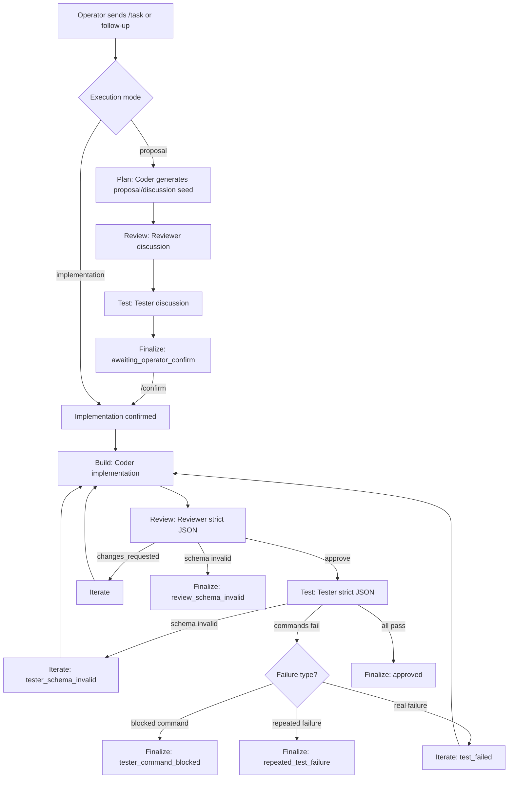
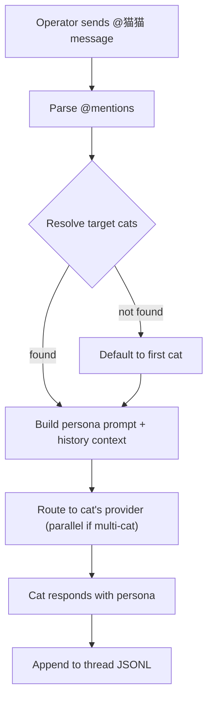

# Workflow Overview | 整体流程总览

Last updated | 最近更新: 2026-03-02
Scope | 范围: Cat Cafe multi-agent runtime workflow (current implementation + chat mode + recommended refinements) | Cat Cafe 多智能体运行时流程（当前实现 + 聊天模式 + 建议优化）

## 1. End-to-end Flow (Current) | 端到端流程（当前）

## 1.1 Chat Mode Flow (New) | 聊天模式流程（新增）

## 2. Roundtable Discussion Mode | 圆桌讨论模式

- EN: Roundtable is used in proposal phase to avoid premature gatekeeping.  
  CN: 在 proposal 阶段使用圆桌讨论，避免过早进入审批门禁。
- EN: Coder outputs proposal/discussion plan.  
  CN: Coder 输出方案草案/讨论起点。
- EN: Reviewer outputs plain-text critique (no JSON schema requirement).  
  CN: Reviewer 输出纯文本评审意见（不强制 JSON schema）。
- EN: Tester outputs plain-text testability/risk comments (no JSON schema requirement).  
  CN: Tester 输出纯文本测试性/风险建议（不强制 JSON schema）。
- EN: System returns `awaiting_operator_confirm` after proposal roundtable.  
  CN: 方案讨论完成后系统统一返回 `awaiting_operator_confirm`。
- EN: Only `/confirm` transitions into implementation.  
  CN: 只有 `/confirm` 才会进入 implementation。

## 3. Implementation Mode | 实施模式

- EN: Implementation keeps strict quality gates.
  CN: 实施阶段保留严格质量门禁。

1. EN: Coder produces implementation output.
   CN: Coder 产出实施结果。
2. EN: Reviewer must pass strict JSON schema and decision rules.
   CN: Reviewer 必须通过严格 JSON schema 与决策规则校验。
3. EN: If reviewer approves, Tester must pass strict JSON schema.
   CN: Reviewer 通过后，Tester 需通过严格 JSON schema。
4. EN: Test commands run via allowlist runner. Prefixes are token-parsed (`argv`) and default to `npm test`, `npm run test`, `node --test`, `pnpm test`, `yarn test`.
   CN: 测试命令通过 allowlist runner 执行。白名单按 token(`argv`)校验，默认前缀为 `npm test`、`npm run test`、`node --test`、`pnpm test`、`yarn test`。
5. EN: Blocked command handling:
   CN: blocked command 处理：
   - EN: Blocked commands are skipped (continue), not immediate stop, even with `stopOnFailure=true`.
     CN: blocked 命令会被跳过（continue），即使 `stopOnFailure=true` 也不会立即中断。
   - EN: `tester_command_blocked` is emitted only when `runnable_commands=0` and blocked commands exist.
     CN: 仅当 `runnable_commands=0` 且存在 blocked 命令时，才判定 `tester_command_blocked`。
   - EN: In `resilient` policy, if first pass is all blocked due to allowlist mismatch, tester gets one explainable retry.
     CN: 在 `resilient` 策略下，若首轮全 blocked 且原因是 allowlist mismatch，会触发一次可解释重试。
6. EN: Test failure handling:
   CN: 测试失败处理（新增）：
   - EN: If same command failed in consecutive rounds → `repeated_test_failure`, stop iteration (avoid loop).
     CN: 若连续两轮相同命令失败 → `repeated_test_failure`，停止迭代（避免死循环）。
   - EN: Otherwise → `test_failed`, iterate back to coder with stderr snippet.
     CN: 其他情况 → `test_failed`，回传 stderr 片段给 coder 继续迭代。

## 3.1 Chat Mode | 聊天模式（新增）

- EN: Chat mode is an independent interaction channel, not part of the FSM pipeline.
  CN: 聊天模式是独立的交互通道，不走 FSM 流水线。
- EN: Triggered by @mention in the composer (e.g. `@牛奶 帮我看看这段代码`).
  CN: 通过 composer 中的 @mention 触发（如 `@牛奶 帮我看看这段代码`）。
- EN: Each cat has a persona prompt injected with personality, peer relationships, and conversation history.
  CN: 每只猫猫有独立的人格 prompt，注入性格描述、同事关系和对话历史。
- EN: Messages are persisted per-thread in `logs/threads/<id>/messages.jsonl`.
  CN: 消息按 thread 持久化到 `logs/threads/<id>/messages.jsonl`。
- EN: Multiple cats can be @mentioned simultaneously (parallel provider calls).
  CN: 可同时 @多只猫猫（并行调用 provider）。
- EN: Chat mode and pipeline mode are mutually exclusive in the UI.
  CN: 聊天模式和流水线模式在 UI 中互斥切换。

## 4. Follow-up and Rerun Branches | 追问与重跑分支

- `/api/tasks/:id/followup`
  - EN: Appends operator message to thread context.  
    CN: 将操作员消息追加到线程上下文。
  - EN: If `awaiting_operator_confirm` and no confirm signal: do not build.  
    CN: 若处于 `awaiting_operator_confirm` 且未确认，不进入构建。
  - EN: If confirm signal present: run implementation in same thread.  
    CN: 若包含确认信号，在同一线程内进入实施。
- `/api/tasks/:id/rerun`
  - EN: Starts a new execution using current prompt and config.  
    CN: 使用当前 prompt 与配置启动一次新执行。
- `/api/tasks/:id/cancel`
  - EN: Sends abort signal to active run.  
    CN: 向当前运行发送中止信号。

## 5. Key Persistence Artifacts | 核心留痕文件

Per task (pipeline mode) | 每个任务（流水线模式）：

- `summary.json`: EN final outcome, rounds, state events, unresolved items | CN 最终结果、轮次、状态事件、未解决项
- `task-events.jsonl`: EN FSM transitions | CN FSM 状态迁移事件
- `task-timeline.json`: EN materialized timeline for replay | CN 用于回放的时间线快照
- `rounds/<nn>/`: EN raw outputs, events, parsed JSON/meta, test results | CN 原始输出、事件、解析结果、测试结果

Per thread (chat mode) | 每个对话（聊天模式）：

- `threads/<id>/meta.json`: EN thread metadata (id, title, created_at) | CN 对话元数据
- `threads/<id>/messages.jsonl`: EN append-only message log | CN 追加写消息日志

## 6. Current Known Gaps | 当前已知缺口

1. ~~EN: Provider network disconnects are sometimes collapsed into schema-invalid outcomes.~~
   ~~CN: Provider 网络断流有时会被归并为 schema-invalid，语义不准确。~~
   → 部分改善：error_class 已区分 provider 级错误，但尚未实现自动重试。
2. ~~EN: Proposal roundtable outputs are not fully distinguished in UI from approval semantics.~~
   ~~CN: UI 中 proposal 圆桌讨论与审批语义尚未完全分离。~~
   → 已改善：UI 现在显示任务标题而非 ID，讨论与审批流程更清晰。
3. EN: Error taxonomy for operator diagnosis is still incomplete.
   CN: 面向操作员诊断的错误分类仍不完整。
4. EN: Chat mode thread list UI not yet implemented (backend API ready).
   CN: 聊天模式的 thread 列表 UI 尚未实现（后端 API 已就绪）。
5. EN: Chat mode lacks /task escape hatch to switch into pipeline mid-conversation.
   CN: 聊天模式缺少 /task 快捷切换到流水线的入口。
6. EN: No fallback strategy when a provider is unavailable (per-role failover).
   CN: Provider 不可用时缺少 fallback 策略（per-role 故障转移）。
7. EN: Retry with backoff not yet implemented for transient provider errors.
   CN: 瞬时 provider 错误的退避重试尚未实现。
