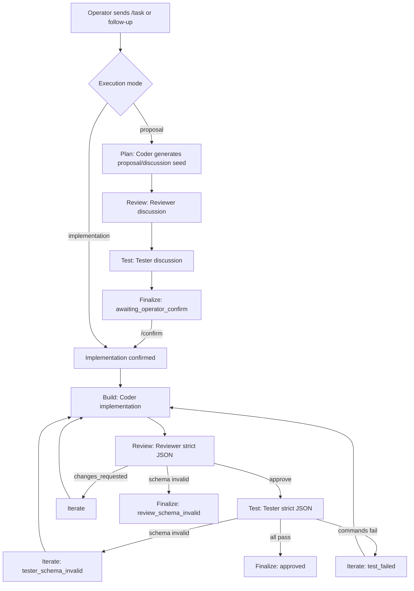

# Workflow Overview

Last updated: 2026-02-17
Scope: Cat Cafe multi-agent runtime workflow (current implementation + recommended refinements)

## 1. End-to-end Flow (Current)

## 2. Roundtable Discussion Mode

Roundtable is used in proposal phase to avoid premature gatekeeping:

- Coder: outputs proposal/discussion plan.
- Reviewer: outputs plain-text critique (no JSON schema requirement).
- Tester: outputs plain-text testability/risk comments (no JSON schema requirement).
- System always returns `awaiting_operator_confirm` after proposal roundtable.
- Only operator `/confirm` transitions workflow into implementation.

## 3. Implementation Mode

Implementation keeps strict quality gates:

1. Coder produces implementation output.
2. Reviewer must pass strict JSON schema and decision logic.
3. If reviewer approves, Tester must pass strict JSON schema.
4. Test commands execute via allowlist runner.
5. Any failure re-enters iterate/build loop until pass or max iterations.

## 4. Follow-up and Rerun Branches

- `/api/tasks/:id/followup`
  - Appends operator message to thread context.
  - If currently `awaiting_operator_confirm` and no confirm signal: return pending confirmation, do not build.
  - If confirm signal present: run implementation in the same thread.
- `/api/tasks/:id/rerun`
  - Starts a new task execution using current prompt and config.
- `/api/tasks/:id/cancel`
  - Sends abort signal to active run.

## 5. Key Persistence Artifacts

Per task:

- `summary.json`: final outcome, rounds, state events, unresolved items.
- `task-events.jsonl`: FSM transitions.
- `task-timeline.json`: materialized transitions for UI replay.
- `rounds/<nn>/`: raw outputs, events, parsed JSON/meta, test results.

## 6. Current Known Gaps

1. Provider network disconnects are currently collapsed into schema-invalid outcomes in some paths.
2. Proposal roundtable outputs are not yet semantically distinguished in UI as "discussion" vs "approval".
3. Error taxonomy is incomplete for operator-level diagnosis.

