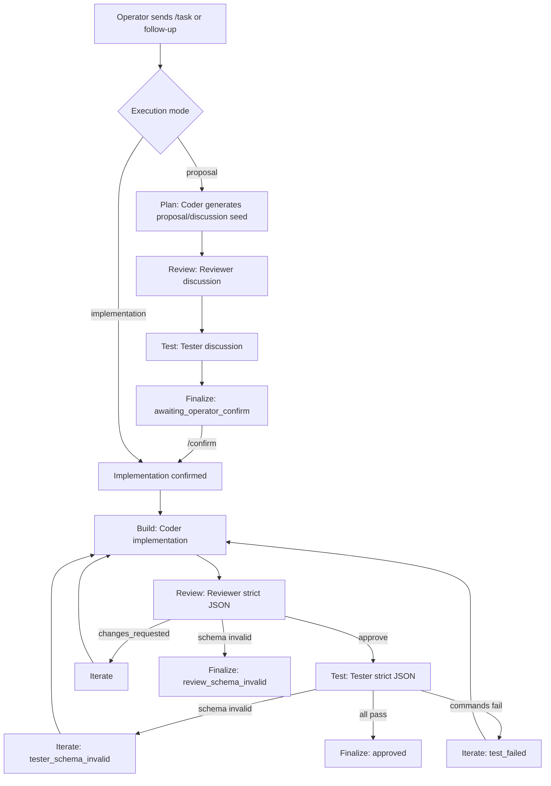

# Workflow Overview | 整体流程总览

Last updated | 最近更新: 2026-02-17  
Scope | 范围: Cat Cafe multi-agent runtime workflow (current implementation + recommended refinements) | Cat Cafe 多智能体运行时流程（当前实现 + 建议优化）

## 1. End-to-end Flow (Current) | 端到端流程（当前）

## 2. Roundtable Discussion Mode | 圆桌讨论模式

- EN: Roundtable is used in proposal phase to avoid premature gatekeeping.  
  CN: 在 proposal 阶段使用圆桌讨论，避免过早进入审批门禁。
- EN: Coder outputs proposal/discussion plan.  
  CN: Coder 输出方案草案/讨论起点。
- EN: Reviewer outputs plain-text critique (no JSON schema requirement).  
  CN: Reviewer 输出纯文本评审意见（不强制 JSON schema）。
- EN: Tester outputs plain-text testability/risk comments (no JSON schema requirement).  
  CN: Tester 输出纯文本测试性/风险建议（不强制 JSON schema）。
- EN: System returns `awaiting_operator_confirm` after proposal roundtable.  
  CN: 方案讨论完成后系统统一返回 `awaiting_operator_confirm`。
- EN: Only `/confirm` transitions into implementation.  
  CN: 只有 `/confirm` 才会进入 implementation。

## 3. Implementation Mode | 实施模式

- EN: Implementation keeps strict quality gates.  
  CN: 实施阶段保留严格质量门禁。

1. EN: Coder produces implementation output.  
   CN: Coder 产出实施结果。  
2. EN: Reviewer must pass strict JSON schema and decision rules.  
   CN: Reviewer 必须通过严格 JSON schema 与决策规则校验。  
3. EN: If reviewer approves, Tester must pass strict JSON schema.  
   CN: Reviewer 通过后，Tester 需通过严格 JSON schema。  
4. EN: Test commands run via allowlist runner.  
   CN: 测试命令通过 allowlist runner 执行。  
5. EN: Any failure re-enters iterate/build loop until pass or max iterations.  
   CN: 任一失败都会回到 iterate/build 循环，直到通过或达到最大迭代。

## 4. Follow-up and Rerun Branches | 追问与重跑分支

- `/api/tasks/:id/followup`
  - EN: Appends operator message to thread context.  
    CN: 将操作员消息追加到线程上下文。
  - EN: If `awaiting_operator_confirm` and no confirm signal: do not build.  
    CN: 若处于 `awaiting_operator_confirm` 且未确认，不进入构建。
  - EN: If confirm signal present: run implementation in same thread.  
    CN: 若包含确认信号，在同一线程内进入实施。
- `/api/tasks/:id/rerun`
  - EN: Starts a new execution using current prompt and config.  
    CN: 使用当前 prompt 与配置启动一次新执行。
- `/api/tasks/:id/cancel`
  - EN: Sends abort signal to active run.  
    CN: 向当前运行发送中止信号。

## 5. Key Persistence Artifacts | 核心留痕文件

Per task | 每个任务：

- `summary.json`: EN final outcome, rounds, state events, unresolved items | CN 最终结果、轮次、状态事件、未解决项
- `task-events.jsonl`: EN FSM transitions | CN FSM 状态迁移事件
- `task-timeline.json`: EN materialized timeline for replay | CN 用于回放的时间线快照
- `rounds/<nn>/`: EN raw outputs, events, parsed JSON/meta, test results | CN 原始输出、事件、解析结果、测试结果

## 6. Current Known Gaps | 当前已知缺口

1. EN: Provider network disconnects are sometimes collapsed into schema-invalid outcomes.  
   CN: Provider 网络断流有时会被归并为 schema-invalid，语义不准确。
2. EN: Proposal roundtable outputs are not fully distinguished in UI from approval semantics.  
   CN: UI 中 proposal 圆桌讨论与审批语义尚未完全分离。
3. EN: Error taxonomy for operator diagnosis is still incomplete.  
   CN: 面向操作员诊断的错误分类仍不完整。
